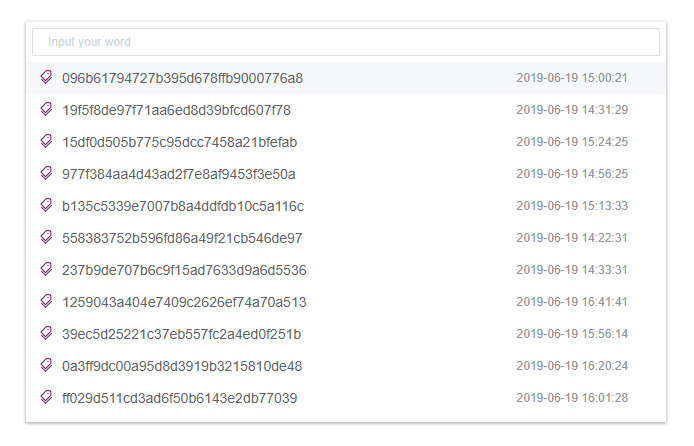
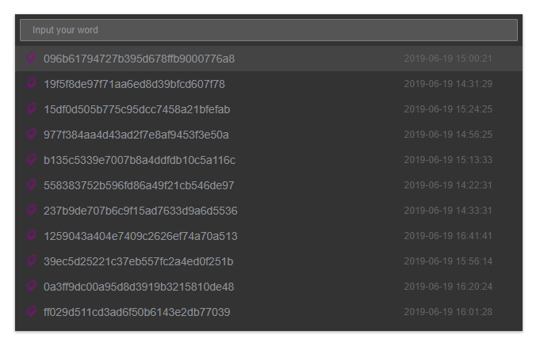

# vue-search-panel

## 简介
[vue-search-panel](https://github.com/TheoXiong/vue-search-panel) 是一个搜索面板组件，可自定义UI、内容，可扩展为命令面板、历史纪录面板、文件选择面板等等。


## 演示

### 默认UI


### 定制化UI


## 安装
``` 
$   npm install vue-search-panel --save
```

## 使用
```
# 引入模块
import VueSearchPanel from 'vue-search-panel'

# 全局注册
Vue.use(VueSearchPanel)

# 组件内使用
<template>
  <vue-search-panel v-model="value" :fetch-suggestions="querySearch"></vue-search-panel>
</template>

<script>
const testdata = [
  { key: 'testdata1', value: 'Test data 1' },
  { key: 'testdata2', value: 'Test data 2' },
  { key: 'testdata3', value: 'Test data 3' }
]

export default {
  data () {
    return {
      value: ''
    }
  },
  methods: {
    querySearch (query, cb) {
      let result = []
      if (query) {
        result = testdata.filter(item => {
          return item.value.toLowerCase().includes(query.toLowerCase())
        })
      } else {
        result = testdata
      }
      cb(result)
    }
  }
}
```

## 参考
- VS Code
- Element UI


