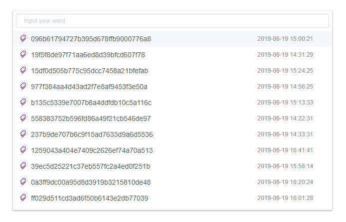
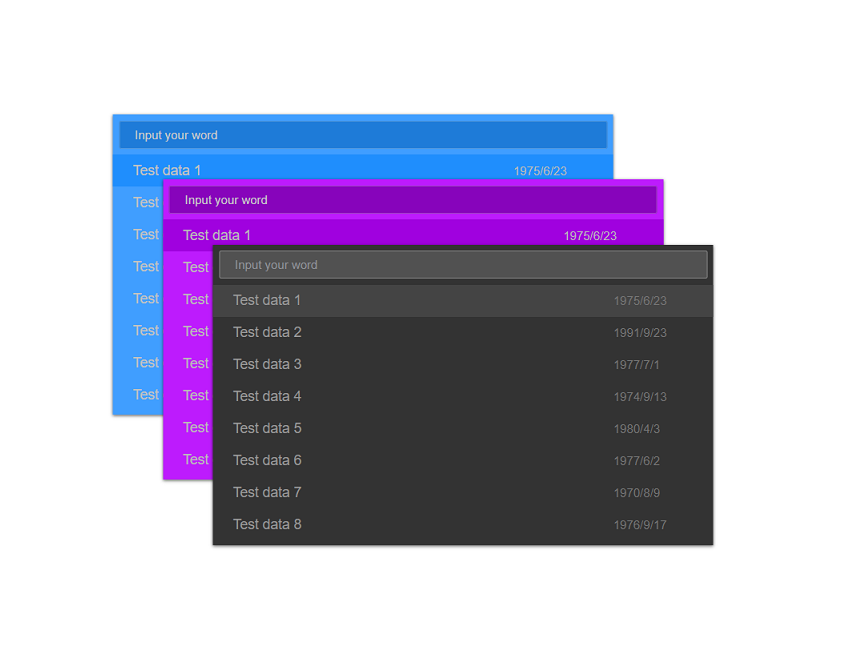

# vue-search-panel

[vue-search-panel](https://github.com/TheoXiong/vue-search-panel) 是一个带输入建议的搜索组件

## 目录
- [特性](#特性)
- [演示](#演示)
   - [线上demo](#线上demo)
   - [默认UI](#默认UI)
   - [定制化UI](#定制化UI)
- [安装](#安装)
- [使用](#使用)
   - [引入模块](#引入模块)
   - [注册](#注册)
   - [基础用法](#基础用法)
   - [自定义建议项](#自定义建议项)
   - [自定义UI](#自定义UI)
   - [配置panel位置](#配置panel位置)
   - [扩展功能](#扩展功能)
- [API](#API)
- [参考](#参考)

## 特性
- 可根据输入内容过滤建议项，可自定义过滤规则
- 可通过slot自定义建议项内容
- 支持自定义UI, 可灵活配置样式
- 可配置panel呈现位置，（相对浏览器）top/bottom/left/right 或位于父级元素内部
- 可扩展功能

## 演示

### 线上demo
链接： [https://theoxiong.github.io/vue-search-panel/](https://theoxiong.github.io/vue-search-panel/) 

### 默认UI


### 自定义UI


## 安装
``` 
$   npm install vue-search-panel --save
```

## 使用

### 引入模块
```
import VueSearchPanel from 'vue-search-panel'
```

### 注册
#### 全局注册
```
Vue.use(VueSearchPanel)
```
#### 组件内注册
```
<script>
export default {
  components: { VueSearchPanel }
}
</script>
```

### 基础用法
通过调用组件的show方法打开search panel，点击panel外部或按ESC键关闭      
        
示例代码：
```
<template>
  <div class="demo-comp">
    <button @click="onOpen">Open Panel</button>
    <div>Selected: {{ selected }}</div>
    <vue-search-panel
      v-model="value"
      :fetch-suggestions="getSuggestions"
      @select="onSelect"
      ref="searchPanel"
    >
    </vue-search-panel>
  </div>
</template>

<script>
import VueSearchPanel from 'vue-search-panel'
const testData = [
  { key: 'test-data-1', value: 'test data 1' },
  { key: 'test-data-2', value: 'test data 2' },
  { key: 'test-data-3', value: 'test data 3' }
]

export default {
  name: 'DemoComp',
  data () {
    return {
      value: '',
      selected: ''
    }
  },
  methods: {
    onOpen () {
      this.$refs.searchPanel.show()
    },
    onSelect (item) {
      this.selected = item.value
    },
    getSuggestions (query, cb) {
      cb(query ? testData.filter(item => { return item.value.includes(query) }) : testData)
    }
  },
  components: { VueSearchPanel }
}
</script>
```

### 自定义建议项
使用scoped slot自定义输入建议的内容，item为当前建议项数据对象          
        
示例代码：
```
<template>
  <div class="demo-comp">
    <button @click="onOpen">Open Panel</button>
    <div>Selected: {{ selected }}</div>
    <vue-search-panel
      v-model="value"
      :fetch-suggestions="getSuggestions"
      @select="onSelect"
      ref="searchPanel"
    >
      <div class="demo-search-item" slot-scope="{ item }">
        <span class="search-item-value">{{ item.value }}</span>
        <span class="search-item-time">{{ item.time }}</span>
      </div>
    </vue-search-panel>
  </div>
</template>

<script>
import VueSearchPanel from 'vue-search-panel'

export default {
  name: 'DemoComp',
  data () {
    return {
      value: '',
      selected: '',
      testData: []
    }
  },
  mounted () {
    for (let i = 0; i < 20; i++) {
      this.testData.push({
        key: `data-${i}`,
        value: `Test data ${i + 1}`,
        time: new Date(Math.random() * 1000000000000).toLocaleDateString()
      })
    }
  },
  methods: {
    onOpen () {
      this.$refs.searchPanel.show()
    },
    onSelect (item) {
      this.selected = item.value
    },
    getSuggestions (query, cb) {
      cb(query ? this.testData.filter(item => { return item.value.includes(query) }) : this.testData)
    }
  },
  components: { VueSearchPanel }
}
</script>

<style scoped>
.demo-search-item{
  display: flex;
  align-items: center;
  justify-content: space-between;
  height: 32px;
  padding: 0 20px;
}
.search-item-value{
  font-size: 14px;
  color: #555;
}
.search-item-time{
  font-size: 12px;
  color: #aaa;
  width: 80px;
}

</style>
```

### 自定义UI
通过props参数自定义UI，可配置颜色、宽度、高度，参数说明可查看API文档         
        
示例代码：
```
<template>
  <div class="demo-comp">
    <button @click="onOpen">Open Panel</button>
    <div>Selected: {{ selected }}</div>
    <vue-search-panel
      v-model="value"
      width="640px"
      height="400px"
      scrollBarColor="#aaaaaa"
      inputColor="#cccccc"
      inputBackground="#555555"
      inputBorderColor="#666666"
      inputBorderColorHovering="#999999"
      inputBorderColorFocused="#bbbbbb"
      placeholderEffect="dark"
      panelBackground="#333333"
      panelBoxShadow="rgba(0, 0, 0, 0.6)"
      highlightedColor="#444444"
      hoveredColor="#666666"
      :fetch-suggestions="getSuggestions"
      @select="onSelect"
      ref="searchPanel"
    >
      <div class="demo-search-item" slot-scope="{ item }">
        <span class="search-item-value">{{ item.value }}</span>
        <span class="search-item-time">{{ item.time }}</span>
      </div>
    </vue-search-panel>
  </div>
</template>

<script>
import VueSearchPanel from 'vue-search-panel'

export default {
  name: 'DemoComp',
  data () {
    return {
      value: '',
      selected: '',
      testData: []
    }
  },
  mounted () {
    for (let i = 0; i < 20; i++) {
      this.testData.push({
        key: `data-${i}`,
        value: `Test data ${i + 1}`,
        time: new Date(Math.random() * 1000000000000).toLocaleDateString()
      })
    }
  },
  methods: {
    onOpen () {
      this.$refs.searchPanel.show()
    },
    onSelect (item) {
      this.selected = item.value
    },
    getSuggestions (query, cb) {
      cb(query ? this.testData.filter(item => { return item.value.includes(query) }) : this.testData)
    }
  },
  components: { VueSearchPanel }
}
</script>

<style scoped>
.demo-search-item{
  display: flex;
  align-items: center;
  justify-content: space-between;
  height: 32px;
  padding: 0 20px;
}
.search-item-value{
  font-size: 14px;
  color: #999;
}
.search-item-time{
  font-size: 12px;
  color: #777;
  width: 80px;
}

</style>
```

### 配置panel位置
通过fixed参数使panel相对于浏览器窗口或父级元素定位
通过placement参数配置panel位于 top/bottom/left/right(相对于浏览器窗口)
> 当fixed为false时，placement参数无效       
         
示例代码：         
```
<template>
  <div class="demo-comp">
    <button @click="onOpen('top')" :disabled="disabled" :class="{'is-disabled': disabled}">Open at top</button>
    <button @click="onOpen('bottom')" :disabled="disabled" :class="{'is-disabled': disabled}">Open at bottom</button>
    <button @click="onOpen('left')" :disabled="disabled" :class="{'is-disabled': disabled}">Open at left</button>
    <button @click="onOpen('right')" :disabled="disabled" :class="{'is-disabled': disabled}">Open at right</button>
    <button @click="onOpen('inner')" :disabled="disabled" :class="{'is-disabled': disabled}">Open at inner</button>
    <div>Selected: {{ selected }}</div>
    <vue-search-panel
      v-model="value"
      :placement="placement"
      :fixed="fixed"
      :fetch-suggestions="getSuggestions"
      @open="onPanelOpen"
      @closed="onPanelClosed"
      @select="onSelect"
      ref="searchPanel"
    >
    </vue-search-panel>
  </div>
</template>

<script>
import VueSearchPanel from 'vue-search-panel'
const testData = [
  { key: 'test-data-1', value: 'test data 1' },
  { key: 'test-data-2', value: 'test data 2' },
  { key: 'test-data-3', value: 'test data 3' }
]

export default {
  name: 'DemoComp',
  data () {
    return {
      value: '',
      selected: '',
      placement: 'top',
      fixed: true,
      disabled: false
    }
  },
  methods: {
    onOpen (position) {
      if (position === 'inner') {
        this.fixed = false
      } else {
        this.fixed = true
        this.placement = position
      }
      this.$refs.searchPanel.show()
    },
    onPanelOpen () {
      this.disabled = true
    },
    onPanelClosed () {
      this.disabled = false
    },
    onSelect (item) {
      this.selected = item.value
    },
    getSuggestions (query, cb) {
      cb(query ? testData.filter(item => { return item.value.includes(query) }) : testData)
    }
  },
  components: { VueSearchPanel }
}
</script>

<style scoped>
.demo-comp{
  margin: 20px;
  width: 600px;
}
.is-disabled,
.is-disabled:active,
.is-disabled:focus,
.is-disabled:hover{
  cursor:not-allowed;
  background-color:#e4e4ee;
}
</style>
```

### 扩展功能

## API

## 参考
- VS Code
- Element UI


